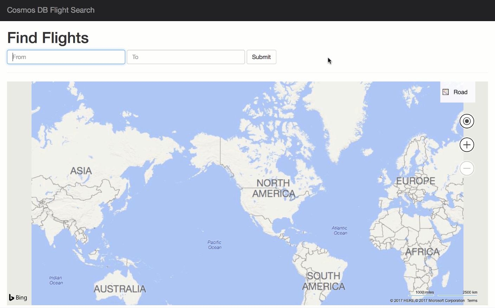

# Cosmos DB Gremlin graph API flights sample

Create a Cosmos DB account. In the account, create a database and a graph.

Configure and run the [airports an routes loader](#airports-and-routes-loader) to load data into the graph.

Configure and run the [web app](#web-app).

## Airports and routes loader

Loads a Cosmos DB Gremlin graph database with airports and routes from [OpenFlights](https://openflights.org/data.html).

### Instructions

Update config file with connection information to your Cosmos DB and run it! There is a lot of data and currently the data is loaded sequentially, so it's going to take a while. Go get a coffee or lunch or something.

## Web app

Allows the user to enter two airport codes and find routes between the airports.

### Instructions

Update the web.config file with connection information to your Cosmos DB and run it! The app currently only accepts airport codes.
